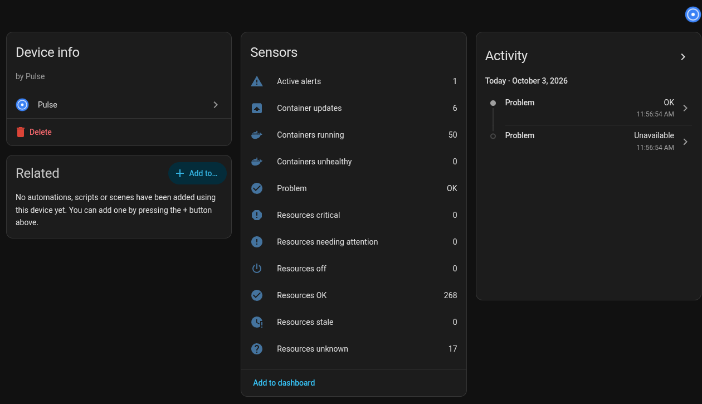
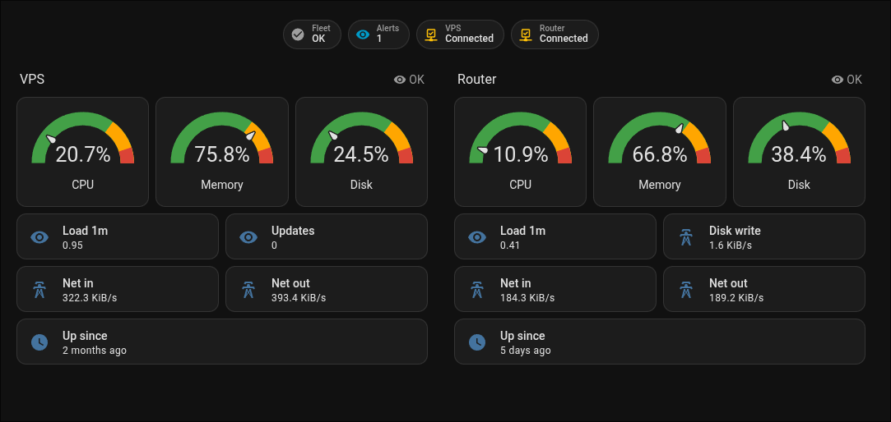

# Pulse for Home Assistant

Custom integration that exposes a [Pulse](https://github.com/rcourtman/Pulse) monitoring server
(agents, Docker containers, fleet health, active alerts) as Home Assistant entities. Polls the
Pulse REST API every 30 seconds.

## Install

Copy `custom_components/pulse_monitor` into your HA `config/custom_components/`, or add this
repository to HACS as a custom repository (category: Integration). Restart Home Assistant.

## Configuration

Settings > Devices & services > Add integration > Pulse.

| Field | Description |
| --- | --- |
| URL | Pulse base URL, e.g. `http://pulse:7655` |
| API token | Pulse API token with the `monitoring:read` scope |
| Verify SSL | Verify the server certificate (default on) |

## Entities

Per agent (one device each): CPU, Memory, Memory used, Disk, Disk used, Load (1m load per core, %),
Network in/out, Disk read/write rate, Last boot, Package updates, Health (ok / attention /
critical / stale / off / unknown), and binary sensor Online.

Per Docker container (device named after its Coolify service label, else container name; linked
to its agent): binary sensors Running, Update available, OOM killed; sensors CPU, Memory, Health,
Started; disabled by default: Memory used, Network in/out, Disk read/write.
Containers are discovered at setup; reload the integration to pick up new ones.

Fleet device "Pulse": Containers running / unhealthy, Container updates, Active alerts (attributes list level, message, resource), a count sensor
for each health verdict, and binary sensor Problem (on when an unacknowledged alert is active or
any resource is critical).

Entities become unavailable when their resource disappears from Pulse.

## Screenshots

## Acknowledgements

This integration started as a fork of [beszel-ha](https://github.com/Ronjar/beszel-ha) by
[Ronjar](https://github.com/Ronjar) — its config flow, coordinator and per-host device layout
were the blueprint we rebuilt on top of Pulse, so huge thanks for the groundwork. Thanks also to
[rcourtman](https://github.com/rcourtman) for [Pulse](https://github.com/rcourtman/Pulse) and
its well-documented API.

## License

MIT — see [LICENSE](LICENSE), which keeps the original beszel-ha copyright notice.
